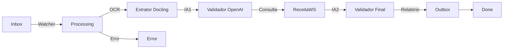
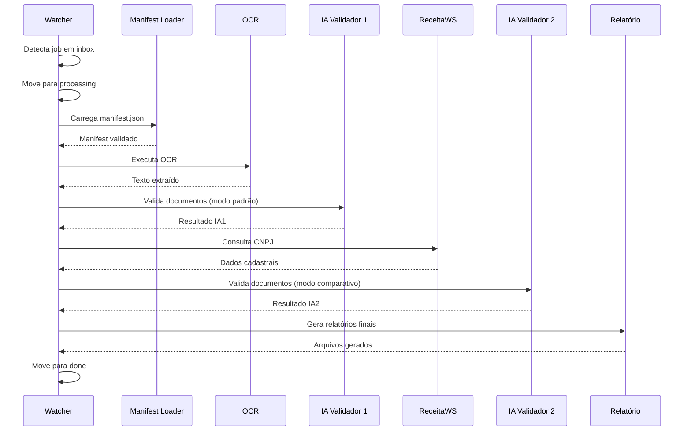

# Manual Técnico: Licitanet + OCR + OpenAI
**Versão 2.0 | Sistema de Validação Documental Automatizada**

---

## 1. Introdução

### 1.1 Visão Geral

O **Licitanet + OCR + OpenAI** é uma aplicação Python desenvolvida para automatizar o processo de validação documental em licitações públicas. O sistema combina tecnologias de OCR (Optical Character Recognition), Inteligência Artificial via OpenAI e consultas a APIs externas para validar documentos de fornecedores (Pessoa Física e Pessoa Jurídica).

**Principais funcionalidades:**
- Extração automática de texto de PDFs e imagens (OCR híbrido)
- Validação inteligente via OpenAI GPT-4
- Consulta de dados cadastrais via ReceitaWS
- Geração automática de relatórios executivos
- Interface web para monitoramento e gestão de jobs

### 1.2 Arquitetura do Sistema

O sistema segue uma arquitetura de **pipeline em etapas**, com separação clara de responsabilidades:



**Fluxo de dados:**
1. **Inbox**: Recebe jobs (pasta com PDFs + manifest.json)
2. **Processing**: Job em processamento ativo
3. **Outbox**: Armazena evidências e resultados intermediários
4. **Done**: Jobs concluídos com sucesso
5. **Error**: Jobs que falharam durante o processamento

### 1.3 Tecnologias Utilizadas

| Tecnologia | Propósito |
|------------|-----------|
| **Python 3.10+** | Linguagem base |
| **Streamlit** | Interface web interativa |
| **OpenAI API (GPT-4)** | Validação inteligente de documentos |
| **Docling** | Extração de texto nativo de PDFs |
| **Tesseract OCR** | Fallback para PDFs escaneados |
| **ReceitaWS** | Consulta de dados cadastrais CNPJ |
| **Loguru** | Sistema de logs estruturados |
| **httpx** | Cliente HTTP para APIs externas |

---

## 2. Instalação e Configuração

### 2.1 Pré-requisitos

**Software necessário:**
- Python 3.10 ou superior
- Tesseract OCR (para OCR de imagens)
- Poppler (para conversão PDF → imagem)

**Instalação do Tesseract (Windows):**
```powershell
# Baixar instalador em: https://github.com/UB-Mannheim/tesseract/wiki
# Adicionar ao PATH: C:\Program Files\Tesseract-OCR
```

**Instalação do Poppler (Windows):**
```powershell
# Baixar em: https://github.com/oschwartz10612/poppler-windows/releases
# Extrair e adicionar bin\ ao PATH
```

### 2.2 Instalação da Aplicação

```bash
# Clone ou extraia o projeto
cd Licitanet_OCR_OpenAI_V2

# Crie ambiente virtual (recomendado)
python -m venv .venv
.venv\Scripts\activate

# Instale dependências
pip install -r requirements.txt
```

### 2.3 Configuração do Arquivo .env

Crie ou edite o arquivo `.env` na raiz do projeto:

```env
# === CHAVES DE API ===
OPENAI_API_KEY=sk-proj-...  # Obrigatório: sua chave OpenAI
OPENAI_MODEL=gpt-4o-mini    # Modelo a ser usado

# === DIRETÓRIOS ===
PATH_INBOX=./inbox
PATH_PROCESSING=./processing
PATH_OUTBOX=./outbox
PATH_DONE=./done
PATH_ERROR=./error
PATH_LOGS=./logs

# === OCR ===
OCR_ENGINE=docling           # docling ou tesseract
OCR_LANG=por                 # Idioma do Tesseract

# === PROCESSAMENTO ===
WAIT_STABILITY_SECONDS=5     # Aguarda upload estabilizar
MAX_RETRIES_OPENAI=3         # Tentativas em caso de erro

# === RECEITAWS ===
RECEITAWS_BASE_URL=https://www.receitaws.com.br/v1/cnpj/
RECEITAWS_TOKEN=             # Opcional: token premium
RECEITAWS_TIMEOUT=20
RECEITAWS_RETRIES=3
RECEITAWS_BACKOFF=1.5
```

**Variáveis críticas:**
- `OPENAI_API_KEY`: **Obrigatória**. Chave da API OpenAI
- `OPENAI_MODEL`: Modelo GPT a usar (padrão: gpt-4o-mini)
- `RECEITAWS_TOKEN`: Opcional. Aumenta limite de consultas

### 2.4 Estrutura de Pastas

A aplicação cria automaticamente as seguintes pastas:

```
Licitanet_OCR_OpenAI_V2/
├── inbox/              # Jobs aguardando processamento
├── processing/         # Jobs em execução
├── outbox/            # Evidências e resultados
│   └── <job_id>/
│       ├── ia/        # Respostas OpenAI
│       ├── serpro/    # Dados ReceitaWS
│       └── resultado/ # Relatórios finais
├── done/              # Jobs concluídos
├── error/             # Jobs com falha
├── evidencias/        # Evidências de OCR
│   └── ocr/
└── logs/              # Logs da aplicação
    ├── app.log
    └── debug.log
```

---

## 3. Guia de Uso

### 3.1 Modo Interface (Streamlit)

**Iniciar a interface:**
```bash
python run_main.py
```

Ou diretamente:
```bash
streamlit run main.py
```

A interface abrirá em `http://localhost:8501` (ou IP local da máquina).

**Funcionalidades da interface:**

#### 📤 Upload de Job
1. Informe um `job_id` único (ex: `job_001`)
2. Faça upload do `manifest.json`
3. Faça upload dos PDFs listados no manifest
4. Clique em "Enviar para processamento"

#### 🕵️ Monitoramento
- Visualize quantidade de jobs em cada status
- Expanda detalhes de cada pasta (Inbox, Processing, Done, Error)

#### ♻️ Reprocessamento
- Selecione jobs com erro
- Execute reprocessamento manual

#### 📊 Relatórios
- Visualize resumo executivo e checklist de jobs concluídos

### 3.2 Modo Contínuo (Watcher)

Para rodar o sistema em modo produção (monitoramento contínuo):

```bash
python main.py
```

O watcher irá:
1. Monitorar a pasta `inbox/` a cada 5 segundos
2. Detectar novos jobs (pastas com `manifest.json`)
3. Processar automaticamente
4. Mover para `done/` ou `error/`

**Logs em tempo real:**
```bash
tail -f logs/app.log
```

### 3.3 Modo Debug (CLI)

Para executar um job específico manualmente:

```bash
python main.py --debug --job job_001
```

**Pré-requisitos:**
- O job deve estar em `processing/job_001/`
- Deve conter `manifest.json` válido

---

## 4. Detalhamento dos Módulos

### 4.1 Orquestrador (`watcher.py`)

**Responsabilidade:** Monitorar inbox e orquestrar o pipeline completo.

**Funções principais:**

#### `detect_and_move_jobs(run_once=False)`
Loop principal que monitora a pasta inbox.

```python
# Execução contínua
detect_and_move_jobs(run_once=False)

# Execução única (útil para testes)
detect_and_move_jobs(run_once=True)
```

#### `process_job(inbox_job_dir)`
Executa o pipeline completo para um job:
1. Valida estabilidade de upload (verifica arquivos `.part`)
2. Move job para `processing/`
3. Carrega e valida `manifest.json`
4. Executa OCR
5. Executa IA Validador 1
6. Consulta ReceitaWS
7. Executa IA Validador 2 (comparativa)
8. Gera relatórios finais
9. Move para `done/` ou `error/`

**Tratamento de erros:**
- Qualquer exceção move o job para `error/`
- Logs detalhados são gravados em `logs/app.log`

### 4.2 OCR (`extrator_docling.py`)

**Responsabilidade:** Extrair texto de PDFs e imagens.

**Estratégia híbrida:**
1. **Primeira tentativa:** Docling (extração de texto nativo)
2. **Fallback:** Tesseract OCR (se texto extraído < 200 caracteres)

#### `executar_ocr(job_id, manifest)`
```python
resultado = executar_ocr("job_001", manifest_data)
# Retorna:
# {
#   "status": "OK",
#   "dados_extraidos": "texto consolidado...",
#   "arquivos": [
#     {"arquivo": "doc.pdf", "metodo": "Docling", "status": "OK"}
#   ]
# }
```

**Evidências geradas:**
- `evidencias/ocr/<job_id>/<arquivo>_Docling.md`
- `evidencias/ocr/<job_id>/<arquivo>_Tesseract.md`

**Configuração:**
- `OCR_ENGINE` no `.env`: escolhe método preferencial
- `OCR_LANG`: idioma do Tesseract (padrão: `por`)

### 4.3 Validação IA (`doc_verifier_agent.py`)

**Responsabilidade:** Validar documentos via OpenAI GPT.

**Modos de operação:**
- **Modo padrão:** Primeira validação (apenas OCR)
- **Modo comparativo:** Validação final (OCR + ReceitaWS + IA1)

#### `validar_documentos_openai(job_id, conteudo, manifest, modo="padrao")`

**Prompts utilizados:**
- `Prompts/prompt_pf_2410.md`: Pessoa Física
- `Prompts/prompt_pj_2410.md`: Pessoa Jurídica

**Evidências geradas:**
```
outbox/<job_id>/ia/
├── <job_id>_entrada_padrao_<timestamp>.json
├── <job_id>_saida_padrao_<timestamp>.json
├── <job_id>_entrada_comparativo_<timestamp>.json
└── <job_id>_saida_comparativo_<timestamp>.json
```

**Configuração OpenAI:**
- Modelo: definido em `OPENAI_MODEL` (.env)
- Temperature: 0.1 (baixa variabilidade)
- Max tokens: 4000

### 4.4 Consulta Externa (`consulta_serpro.py`)

**Responsabilidade:** Consultar dados cadastrais via ReceitaWS.

**Características:**
- Retries automáticos com backoff exponencial
- Tratamento de rate limiting
- Nunca lança exceção (retorna dict padronizado)

#### `consultar_cnpj(manifest)`
```python
resultado = consultar_cnpj(manifest_data)
# Retorna:
# {
#   "status": "OK",
#   "cnpj": "12345678000190",
#   "dados": {...},  # Dados da ReceitaWS
#   "serpro_disponivel": False
# }
```

**Estratégia de retry:**
1. Tentativa 1: imediata
2. Tentativa 2: aguarda 1.5s
3. Tentativa 3: aguarda 2.25s

**Evidências geradas:**
```
outbox/<job_id>/serpro/
├── <job_id>_entrada_receitaws_<timestamp>.json
└── <job_id>_saida_receitaws_<timestamp>.json
```

### 4.5 Relatórios (`relatorio.py`)

**Responsabilidade:** Consolidar resultados e gerar relatórios finais.

#### `gerar_relatorio_final(job_id, manifest, ocr_result, ia1_result, serpro_result, ia2_result)`

**Arquivos gerados:**
```
outbox/<job_id>/resultado/
├── resumo_executivo.md      # Resumo para leitura humana
├── checklist_validacao.md   # Checklist de conformidade
├── historico.txt            # Histórico do fornecedor
├── email_sugerido.md        # Modelo de email
└── resultado_tecnico.json   # Dados completos (JSON)
```

**Conteúdo do resumo executivo:**
- Job ID e CNPJ
- Status de cada etapa (OCR, IA1, Serpro, IA2)
- Data de execução
- Observações gerais

### 4.6 Frontend (`interface_frontend.py`)

**Responsabilidade:** Interface web Streamlit.

**Abas disponíveis:**

1. **Upload de Job**
   - Upload de manifest.json e PDFs
   - Criação de novo job em `inbox/`

2. **Monitoramento**
   - Métricas de jobs por status
   - Detalhamento de cada pasta

3. **Reprocessamento**
   - Lista jobs com erro
   - Executa pipeline manual

4. **Relatórios**
   - Visualiza resumo executivo
   - Visualiza checklist de validação

### 4.7 Utilitários

#### `log_service.py`
Sistema de logs unificado com Loguru.

**Funções principais:**
- `get_logger(name)`: Retorna logger configurado
- `init_folders()`: Cria estrutura de pastas
- `registrar_evento(...)`: Registra evento com evidência JSON

**Logs gerados:**
- `logs/app.log`: Nível INFO (rotação 10MB, retenção 30 dias)
- `logs/debug.log`: Nível DEBUG (rotação 5MB, retenção 15 dias)

#### `env_loader.py`
Carregamento seguro de variáveis de ambiente.

**Funções:**
- `get_client()`: Retorna cliente OpenAI configurado
- `get_model(default)`: Retorna modelo configurado

**Segurança:**
- Força uso da chave do `.env`
- Mascara chave nos logs
- Valida presença de `OPENAI_API_KEY`

#### `manifest_loader.py`
Validação e normalização do manifest.json.

**Schema v3:**
- Campos obrigatórios: `job_id`, `fornecedor_id`, `arquivos`, `perfil_validacao`
- Validação via JSON Schema
- Normalização de defaults
- Verificação de existência de arquivos

---

## 5. Fluxos e Lógica de Negócio

### 5.1 Pipeline Completo de Processamento



**Detalhamento de cada etapa:**

#### Etapa 1: OCR
- **Entrada:** PDFs listados no manifest
- **Processamento:** Docling → Tesseract (fallback)
- **Saída:** Texto consolidado de todos os documentos
- **Evidência:** `evidencias/ocr/<job_id>/`

#### Etapa 2: IA Validador 1
- **Entrada:** Texto extraído do OCR
- **Processamento:** Envio para OpenAI com prompt PF/PJ
- **Saída:** Validação inicial estruturada
- **Evidência:** `outbox/<job_id>/ia/*_padrao_*.json`

#### Etapa 3: Consulta ReceitaWS
- **Entrada:** CNPJ do manifest
- **Processamento:** Consulta API ReceitaWS com retries
- **Saída:** Dados cadastrais oficiais
- **Evidência:** `outbox/<job_id>/serpro/`

#### Etapa 4: IA Validador 2
- **Entrada:** OCR + ReceitaWS + IA1
- **Processamento:** Validação comparativa via OpenAI
- **Saída:** Validação final consolidada
- **Evidência:** `outbox/<job_id>/ia/*_comparativo_*.json`

#### Etapa 5: Relatórios
- **Entrada:** Todos os resultados anteriores
- **Processamento:** Geração de Markdown e JSON
- **Saída:** 5 arquivos de relatório
- **Evidência:** `outbox/<job_id>/resultado/`

### 5.2 Tratamento de Erros

**Estratégia de erro:**
1. Qualquer exceção não tratada move job para `error/`
2. Logs detalhados são gravados
3. Evidências parciais são preservadas

**Tipos de erro comuns:**

| Erro | Causa | Solução |
|------|-------|---------|
| `FileNotFoundError` | Manifest ou PDF ausente | Verificar arquivos no job |
| `ValidationError` | Manifest inválido | Corrigir estrutura JSON |
| `OpenAI API Error` | Chave inválida ou limite | Verificar `.env` e créditos |
| `ReceitaWS Timeout` | API indisponível | Aguardar e reprocessar |
| `OCR Failed` | PDF corrompido | Verificar integridade do arquivo |

**Reprocessamento:**
1. Via interface: aba "Reprocessamento"
2. Via CLI: `python main.py --debug --job <job_id>`
3. Manual: mover de `error/` para `inbox/`

### 5.3 Logs e Evidências

**Hierarquia de logs:**
```
logs/
├── app.log       # INFO: eventos principais
└── debug.log     # DEBUG: detalhes técnicos
```

**Formato de log (Loguru):**
```
2025-12-03 13:30:45.123 | INFO     | watcher:process_job:101 - [job_001] Novo job detectado
```

**Evidências por etapa:**
```
evidencias/ocr/<job_id>/          # Textos extraídos
outbox/<job_id>/ia/               # Entrada/saída OpenAI
outbox/<job_id>/serpro/           # Entrada/saída ReceitaWS
outbox/<job_id>/resultado/        # Relatórios finais
```

**Auditoria completa:**
Todas as evidências são timestampadas e preservadas para auditoria futura.

---

## 6. Manutenção e Troubleshooting

### 6.1 Problemas Comuns

#### ❌ "Arquivo travado em processing"

**Sintoma:** Job não sai de `processing/`

**Causas possíveis:**
1. Aplicação foi interrompida durante processamento
2. Erro não capturado

**Solução:**
```bash
# Verificar logs
tail -n 100 logs/app.log

# Mover manualmente para error
mv processing/job_001 error/

# Reprocessar via interface ou CLI
python main.py --debug --job job_001
```

#### ❌ "OpenAI API Error: Invalid API Key"

**Sintoma:** Erro ao chamar OpenAI

**Solução:**
1. Verificar `.env`:
   ```env
   OPENAI_API_KEY=sk-proj-...
   ```
2. Validar chave em: https://platform.openai.com/api-keys
3. Verificar créditos disponíveis

#### ❌ "Tesseract not found"

**Sintoma:** Erro ao executar OCR com Tesseract

**Solução (Windows):**
```powershell
# Instalar Tesseract
# Download: https://github.com/UB-Mannheim/tesseract/wiki

# Adicionar ao PATH
setx PATH "%PATH%;C:\Program Files\Tesseract-OCR"

# Reiniciar terminal e testar
tesseract --version
```

#### ❌ "ReceitaWS rate limit exceeded"

**Sintoma:** Erro 429 ou mensagem de limite

**Solução:**
1. Aguardar alguns minutos
2. Configurar token premium no `.env`:
   ```env
   RECEITAWS_TOKEN=seu_token_aqui
   ```
3. Aumentar backoff:
   ```env
   RECEITAWS_BACKOFF=2.0
   ```

### 6.2 Como Adicionar Novos Prompts

**Localização dos prompts:**
```
Prompts/
├── prompt_pf_2410.md    # Pessoa Física
└── prompt_pj_2410.md    # Pessoa Jurídica
```

**Estrutura do prompt:**
```markdown
# Sistema de Validação Documental - Pessoa Jurídica

Você é um especialista em análise documental...

## Regras de Validação
1. Verificar CNPJ...
2. Validar endereço...

## Formato de Resposta
Retorne JSON estruturado:
{
  "cnpj_valido": true,
  "endereco_confere": true,
  ...
}
```

**Para criar novo prompt:**
1. Copie um prompt existente
2. Edite as regras de validação
3. Salve com nome descritivo (ex: `prompt_pj_mei.md`)
4. Atualize `doc_verifier_agent.py`:
   ```python
   PROMPT_MEI_PATH = os.getenv("PROMPT_MEI_PATH", "./prompts/prompt_pj_mei.md")
   ```

### 6.3 Atualização de Dependências

**Verificar versões atuais:**
```bash
pip list
```

**Atualizar biblioteca específica:**
```bash
pip install --upgrade openai
```

**Atualizar todas as dependências:**
```bash
pip install --upgrade -r requirements.txt
```

**Gerar novo requirements.txt:**
```bash
pip freeze > requirements.txt
```

**Dependências críticas:**
- `openai>=2.7.2`: API OpenAI
- `streamlit>=1.51.0`: Interface web
- `docling>=2.61.2`: OCR de PDFs
- `loguru>=0.7.3`: Sistema de logs

### 6.4 Backup e Recuperação

**Dados a fazer backup:**
```
done/           # Jobs concluídos
outbox/         # Evidências e relatórios
logs/           # Histórico de execução
.env            # Configurações (sem versionar)
```

**Script de backup (exemplo):**
```bash
# Criar backup com data
$date = Get-Date -Format "yyyyMMdd"
Compress-Archive -Path done,outbox,logs -DestinationPath "backup_$date.zip"
```

### 6.5 Monitoramento de Performance

**Métricas importantes:**
- Tempo médio por job
- Taxa de sucesso/erro
- Uso de tokens OpenAI
- Latência ReceitaWS

**Verificar performance:**
```bash
# Contar jobs por status
ls inbox | Measure-Object
ls processing | Measure-Object
ls done | Measure-Object
ls error | Measure-Object

# Verificar tamanho dos logs
ls -lh logs/
```

---

## 7. Anexos

### 7.1 Exemplo de Manifest.json

```json
{
  "job_id": "job_20251203_001",
  "fornecedor_id": "12345678000190",
  "perfil_validacao": "PJ",
  "contexto": {
    "cnpj": "12345678000190",
    "razao_social": "Empresa Exemplo LTDA",
    "licitacao_id": "LIC-2025-001"
  },
  "arquivos": [
    {
      "id": "doc_001",
      "nome": "contrato_social.pdf",
      "tipo_previsto": "Contrato Social",
      "origem": "upload_web",
      "paginas": 5,
      "hash": "abc123def456",
      "legibilidade_score": 0.95,
      "opcional": false
    },
    {
      "id": "doc_002",
      "nome": "certidao_negativa.pdf",
      "tipo_previsto": "Certidão Negativa",
      "origem": "upload_web",
      "paginas": 2,
      "hash": "xyz789uvw012",
      "legibilidade_score": 0.88,
      "opcional": false
    }
  ],
  "metadados": {
    "usuario_upload": "admin",
    "data_upload": "2025-12-03T13:30:00"
  }
}
```

**Campos obrigatórios:**
- `job_id`: Identificador único do job (min 8 caracteres)
- `fornecedor_id`: CNPJ ou CPF do fornecedor
- `perfil_validacao`: "PF" ou "PJ"
- `arquivos`: Array com pelo menos 1 arquivo

**Campos opcionais:**
- `subperfil_pf`: "PF_Pura" ou "PF_EI" (apenas para PF)
- `contexto`: Dados adicionais do contexto
- `metadados`: Metadados customizados

### 7.2 Glossário de Termos

| Termo | Definição |
|-------|-----------|
| **Job** | Unidade de processamento (pasta com manifest + PDFs) |
| **Manifest** | Arquivo JSON com metadados do job |
| **OCR** | Optical Character Recognition (reconhecimento de texto) |
| **Docling** | Biblioteca para extração de texto nativo de PDFs |
| **Tesseract** | Engine OCR open-source para imagens |
| **ReceitaWS** | API pública para consulta de CNPJ |
| **IA1** | Primeira validação via OpenAI (apenas OCR) |
| **IA2** | Segunda validação via OpenAI (comparativa) |
| **Watcher** | Serviço que monitora inbox e processa jobs |
| **Pipeline** | Sequência de etapas de processamento |
| **Evidência** | Arquivo de auditoria (entrada/saída de cada etapa) |
| **Perfil** | Tipo de validação (PF = Pessoa Física, PJ = Pessoa Jurídica) |

### 7.3 Referências Técnicas

**Documentação oficial:**
- OpenAI API: https://platform.openai.com/docs
- Streamlit: https://docs.streamlit.io
- Docling: https://github.com/DS4SD/docling
- Tesseract: https://github.com/tesseract-ocr/tesseract
- ReceitaWS: https://receitaws.com.br/api

**Contato e Suporte:**
- Para dúvidas técnicas, consulte os logs em `logs/debug.log`
- Para melhorias, documente no repositório do projeto

---

**Fim do Manual Técnico**
